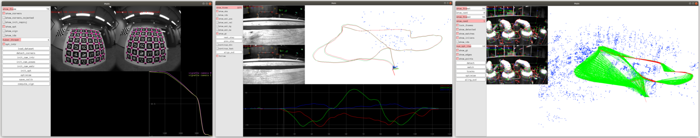

[](https://gitlab.com/VladyslavUsenko/basalt/commits/master)

## Basalt
For more information see https://vision.in.tum.de/research/vslam/basalt



This project contains tools for:
* Camera, IMU and motion capture calibration.
* Visual-inertial odometry and mapping.
* Simulated environment to test different components of the system.

Some reusable components of the system are available as a separate [header-only library](https://gitlab.com/VladyslavUsenko/basalt-headers) ([Documentation](https://vladyslavusenko.gitlab.io/basalt-headers/)).

There is also a [Github mirror](https://github.com/VladyslavUsenko/basalt-mirror) of this project to enable easy forking.

## Related Publications
Visual-Inertial Odometry and Mapping:
* **Visual-Inertial Mapping with Non-Linear Factor Recovery**, V. Usenko, N. Demmel, D. Schubert, J. Stückler, D. Cremers, In IEEE Robotics and Automation Letters (RA-L) [[DOI:10.1109/LRA.2019.2961227]](https://doi.org/10.1109/LRA.2019.2961227) [[arXiv:1904.06504]](https://arxiv.org/abs/1904.06504).

Calibration (explains implemented camera models):
* **The Double Sphere Camera Model**, V. Usenko and N. Demmel and D. Cremers, In 2018 International Conference on 3D Vision (3DV), [[DOI:10.1109/3DV.2018.00069]](https://doi.org/10.1109/3DV.2018.00069), [[arXiv:1807.08957]](https://arxiv.org/abs/1807.08957).

Calibration (demonstrates how these tools can be used for dataset calibration):
* **The TUM VI Benchmark for Evaluating Visual-Inertial Odometry**, D. Schubert, T. Goll,  N. Demmel, V. Usenko, J. Stückler, D. Cremers, In 2018 International Conference on Intelligent Robots and Systems (IROS), [[DOI:10.1109/IROS.2018.8593419]](https://doi.org/10.1109/IROS.2018.8593419), [[arXiv:1804.06120]](https://arxiv.org/abs/1804.06120).

Calibration (describes B-spline trajectory representation used in camera-IMU calibration):
* **Efficient Derivative Computation for Cumulative B-Splines on Lie Groups**, C. Sommer, V. Usenko, D. Schubert, N. Demmel, D. Cremers, In 2020 Conference on Computer Vision and Pattern Recognition (CVPR), [[DOI:10.1109/CVPR42600.2020.01116]](https://doi.org/10.1109/CVPR42600.2020.01116), [[arXiv:1911.08860]](https://arxiv.org/abs/1911.08860).


## Installation
### APT installation for Ubuntu 20.04 and 18.04 (Fast)
Set up keys, add the repository to the sources list, update the Ubuntu package index and install Basalt:
```
sudo apt-key adv --keyserver keyserver.ubuntu.com --recv-keys 0D97B6C9
sudo sh -c 'echo "deb [arch=amd64] http://packages.usenko.eu/ubuntu $(lsb_release -sc) main" > /etc/apt/sources.list.d/basalt.list'
sudo apt-get update
sudo apt-get install basalt
```

### Source installation for Ubuntu >= 18.04 and MacOS >= 10.14 Mojave
Clone the source code for the project and build it. For MacOS you should have [Homebrew](https://brew.sh/) installed.
```
git clone --recursive https://gitlab.com/VladyslavUsenko/basalt.git
cd basalt
./scripts/install_deps.sh
mkdir build
cd build
cmake .. -DCMAKE_BUILD_TYPE=RelWithDebInfo
make -j8
```
NOTE: It is possible to compile the code on Ubuntu 16.04, but you need to install cmake-3.10 or higher and gcc-7. See corresponding [Dockerfile](docker/b_image_xenial/Dockerfile) as an example.

## Usage
* [Camera, IMU and Mocap calibration. (TUM-VI, Euroc, UZH-FPV and Kalibr datasets)](doc/Calibration.md)
* [Visual-inertial odometry and mapping. (TUM-VI and Euroc datasets)](doc/VioMapping.md)
* [Visual odometry (no IMU). (KITTI dataset)](doc/Vo.md)
* [Simulation tools to test different components of the system.](doc/Simulation.md)

## Device support
* [Tutorial on Camera-IMU and Motion capture calibration with Realsense T265.](doc/Realsense.md)

## Development
* [Development environment setup.](doc/DevSetup.md)

## Licence
The code is provided under a BSD 3-clause license. See the LICENSE file for details.
Note also the different licenses of thirdparty submodules.
